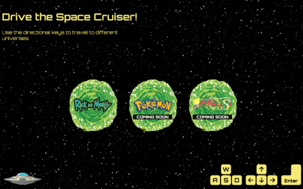
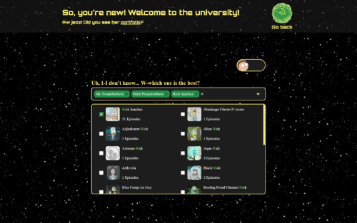
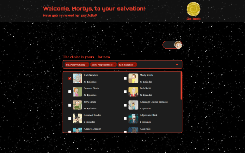

# Evil Morty

## Project Description

This website contains web pages that you can visit by clicking on portals or by driving the spaceship with the keyboard.

#### Used Technologies:

- React
- Typescript
- Redux toolkit
- Axios
- Scss

## How to Install and Run the Project

1. **Clone** the project
2. **Run** npm install
3. **Run** npm run build

**Not:** The project run "http://localhost:5173"

## What does the project look like?

- To see the project click [here](https://evil-morty.vercel.app/)

